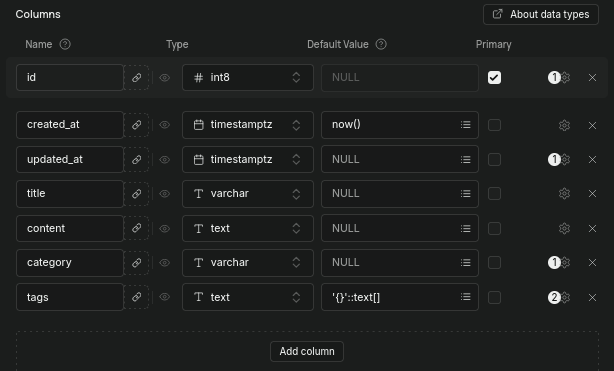

# API-BLOGGING-PLATFORM

**Roadmap SH Link:** https://roadmap.sh/projects/blogging-platform-api

---

**Overview:** This is the project that I have built according to the instructions that can be found on the *API-BLOGGING-PLATFORM* found on Roadmap.sh

## Installation

1. Clone the Repo
```
    git clone https://github.com/Muelvzz/api-blogging-platform
    cd api-blogging-platform
```
2. Install the required packages dependencies
```
    npm install
    npm run build
```
3. Create a Supabase Database, and inside it - create a table named *"api-blogging-platform"* and set these following fields:

4. On the *api-blogging-platform* directory. Create a **.env** file to set these following variables:
```
    SUPABASE_DB_PASSWORD=
    SUPABASE_DB_URL=
    SUPABASE_SECRET_KEY=
    PORT=3000
```
5. Perform `npm run test` to ensure that the project is working properly.

## How to run the project?

To run the project, you need to type `npm run dev` on the *api-blogging-platform* directory. This should redirect you to the `http://localhost:3000`